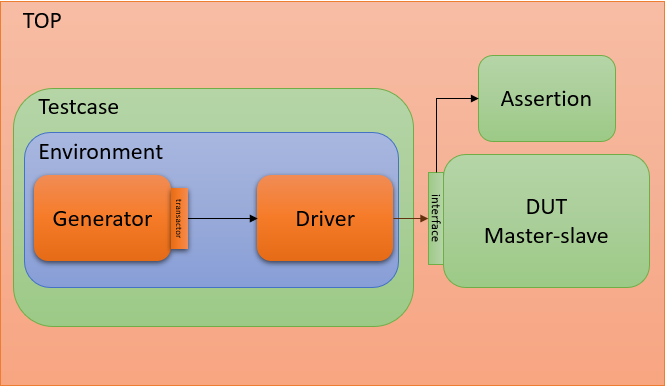
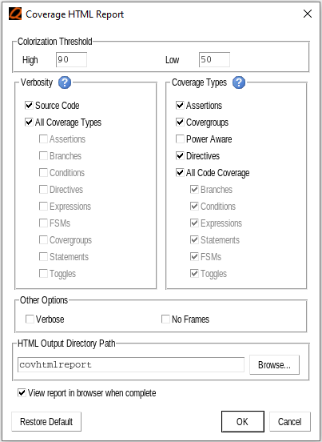
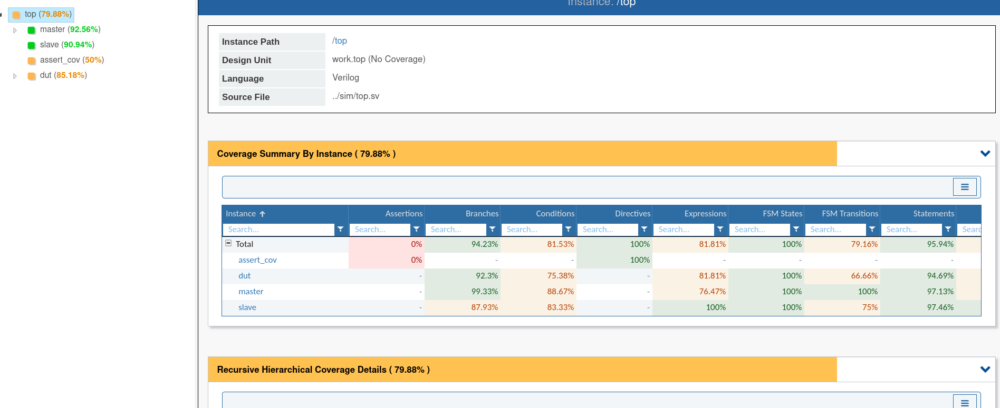

# I2C Verification
## I. Overview
    - Verify i2c module's RTL code by using Systemverilog language and Questa Sim environment

Figure 1: Verification hierarchy
## II. Test plan 
- [Link test plan](https://docs.google.com/spreadsheets/d/1tK4Wvbe__ZDq5PuG14L_p0yJ2tXGeZJl2Gx0qoWsU2A/edit#gid=0)
## III. Instructions for checking coverage report
    - Coverage report is saved in "work/final.ucdp"
    - Open that file in Questa Sim.
    - At the task bar on top, select "Tools/Coverage Report/HTML..." and select catagories arcording the image below: 

    - Click "OK", "covhtmlreport" folder will be created. 
    - Use the web brower to open "index.html" file in that folder. All coverage reports will be showed.
